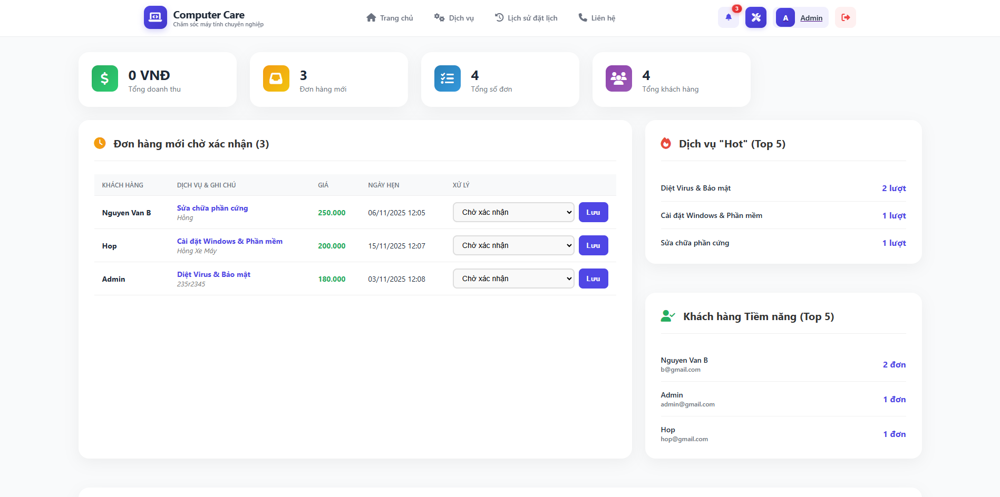
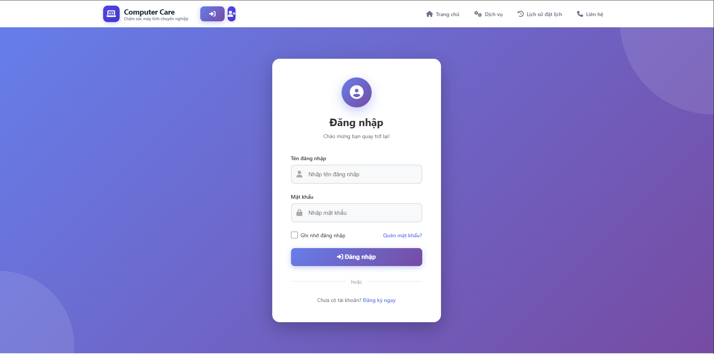
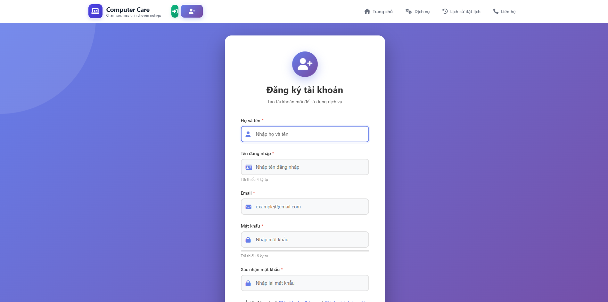
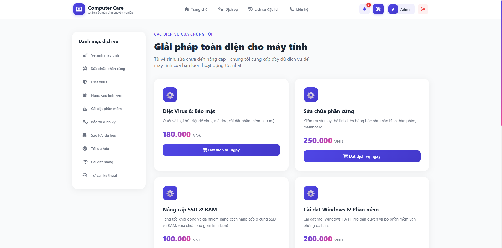
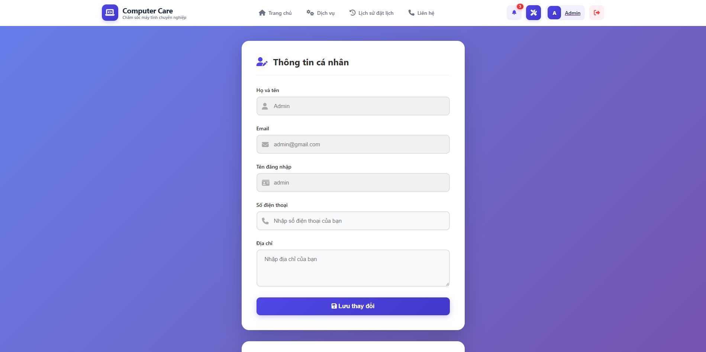
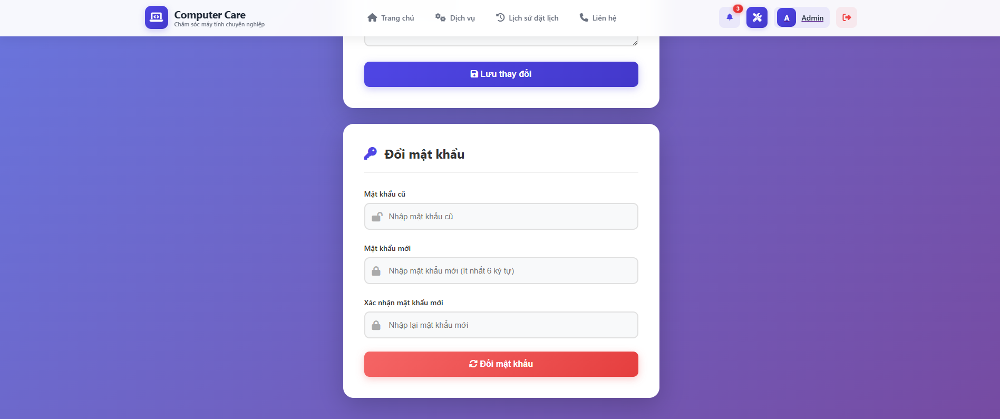
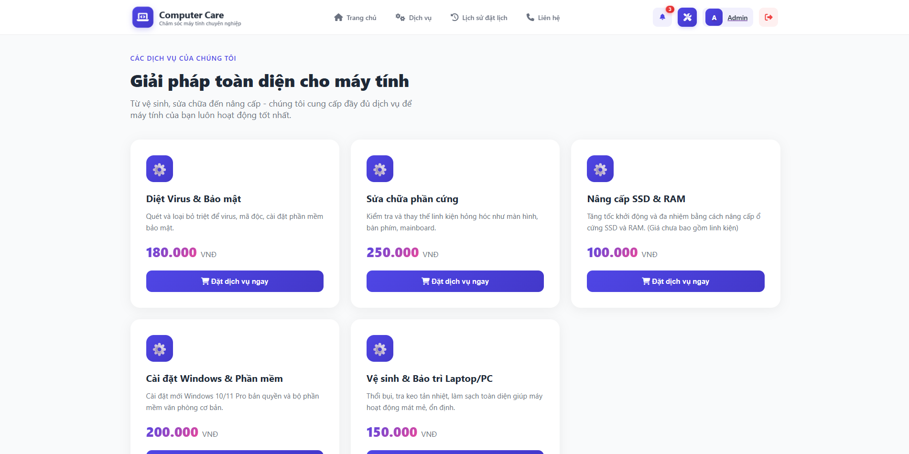
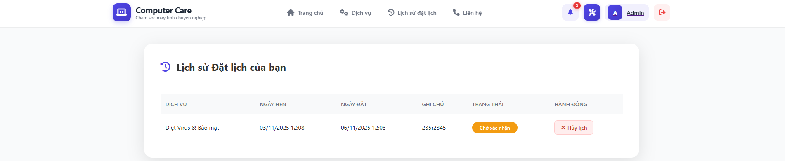
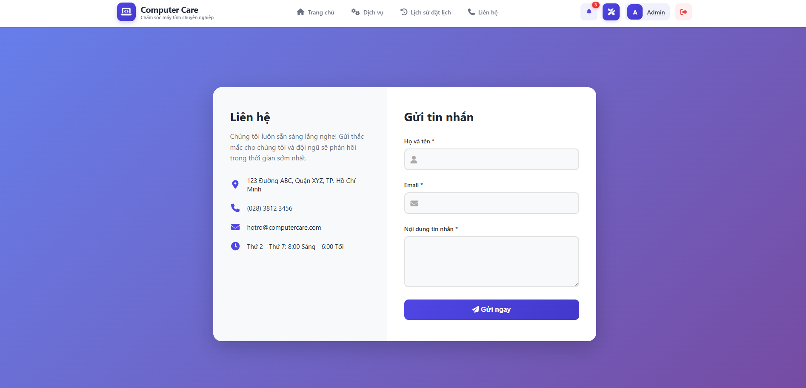
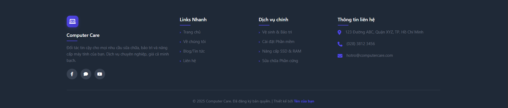

<h1 align="center">
  🖥️ Hệ thống Quản lý Dịch vụ Chăm sóc Máy tính (Computer Care) 🖥️
</h1>

<p align="center">
  Một ứng dụng web PHP/MySQL (sử dụng XAMPP) được xây dựng để tin học hóa quy trình đặt lịch và quản lý dịch vụ sửa chữa, bảo trì máy tính.
</p>

<p align="center">
  
  
  
  
</p>

<p align="center">
  
</p>

---

## 📋 Mục lục

1.  [Giới thiệu](#-1-giới-thiệu)
2.  [Tính năng Nổi bật](#-2-tính-năng-nổi-bật)
3.  [Công nghệ sử dụng](#-3-công-nghệ-sử-dụng)
4.  [Cấu trúc Thư mục](#-4-cấu-trúc-thư-mục)
5.  [Hướng dẫn Cài đặt](#-5-hướng-dẫn-cài-đặt)
6.  [Hình ảnh Chức năng](#-6-hình-ảnh-chức-năng)
7.  [Tác giả](#-7-tác-giả)

---

## 📖 1. Giới thiệu

Hệ thống **Quản lý Dịch vụ Chăm sóc Máy tính (Computer Care)** được xây dựng nhằm mục đích tin học hóa quy trình đặt lịch và quản lý dịch vụ sửa chữa, bảo trì máy tính chuyên nghiệp. Thay vì quản lý thủ công qua điện thoại hoặc tin nhắn rời rạc, hệ thống mang đến một giải pháp tập trung, nơi khách hàng có thể dễ dàng xem dịch vụ, đặt lịch hẹn, và theo dõi trạng thái đơn hàng của mình. Đồng thời, hệ thống cung cấp cho quản trị viên (Admin) một bảng điều khiển mạnh mẽ để quản lý dịch vụ, xử lý đơn đặt lịch và xem thống kê kinh doanh.

## ✨ 2. Tính năng Nổi bật

Hệ thống được phân chia làm 2 vai trò chính với các chức năng rõ rệt:

| 👨‍💻 Chức năng Khách hàng (User) | ⚙️ Chức năng Quản trị (Admin) |
| :--- | :--- |
| ✅ Đăng ký / Đăng nhập (Băm mật khẩu) | ✅ **Dashboard Tổng quan** (KPIs, Doanh thu, Đơn mới) |
| ✅ Trang chủ (Giới thiệu, Quy trình) | ✅ **Quản lý Đơn hàng** (Giao diện Tab: Mới, Đang xử lý...) |
| ✅ Xem chi tiết tất cả Dịch vụ (có hình ảnh) | ✅ **Cập nhật Trạng thái** đơn hàng (Pending -> Completed...) |
| ✅ Đặt lịch hẹn (Form chuyên nghiệp) | ✅ Thống kê Dịch vụ "Hot", Khách hàng "VIP" |
| ✅ Chọn Loại thiết bị (PC/Laptop) | ✅ **Quản lý Dịch vụ (CRUD)**: Thêm / Sửa / Xóa Dịch vụ |
| ✅ Chọn Hình thức (Tại nhà / Mang đến) | ✅ Thao tác nhanh (Sửa/Xóa Dịch vụ) ngay trên Dashboard |
| ✅ **Lịch sử Đặt lịch** (Theo dõi trạng thái) | ✅ **Quản lý Tài khoản (CRUD)**: Xem / Xóa / Phân quyền |
| ✅ Hủy đơn hàng (nếu đang chờ xử lý) | ✅ Bảo vệ trang Admin (Chỉ `role` admin được vào) |
| ✅ Cập nhật thông tin cá nhân (Profile) | ✅ Bảo mật chống SQL Injection (Prepared Statements) |
| ✅ Thay đổi mật khẩu (Xác thực mật khẩu cũ) | ✅ Giao diện Admin Menu (Dính, dễ điều hướng) |

## 🚀 3. Công nghệ sử dụng

* **Backend:** **PHP 8.0** (Xử lý logic, quản lý phiên).
* **Database:** **MySQL** (Lưu trữ dữ liệu người dùng, dịch vụ, đơn hàng).
* **Frontend:** **HTML5**, **CSS3** (Flexbox/Grid, Animations), **JavaScript (ES6)** (Tương tác form, tính tổng tiền động).
* **Web Server:** **XAMPP** (Sử dụng Apache & MySQL).
* **Tools:** Visual Studio Code, Git & GitHub.

## 📁 4. Cấu trúc Thư mục

Dự án được tổ chức theo cấu trúc gọn gàng, tách biệt logic và giao diện:

/computer_service/ ├── admin/ (Trang Quản trị) │ ├── index.php (Dashboard, QL Đơn hàng) │ ├── services.php (QL Dịch vụ) │ ├── users.php (QL User) │ └── admin_check.php (File bảo vệ) │ ├── config/ │ └── db.php (Kết nối CSDL & BASE_URL) │ ├── page/ (Các trang chức năng của User) │ ├── login.php │ ├── register.php │ ├── profile.php │ ├── booking.php │ ├── my_bookings.php │ ├── services.php │ └── ... │ ├── templates/ (Header & Footer chung) │ ├── header.php │ └── footer.php │ ├── images/ (Ảnh chụp màn hình cho README) │ ├── dashboard.png │ └── ... │ ├── index.php (Trang chủ công khai) └── README.md
## ⚙️ 5. Hướng dẫn Cài đặt

### 5.1. Yêu cầu
* **XAMPP** (Khuyến nghị bản hỗ trợ PHP 8.0+).
* Một trình duyệt web (Chrome, Firefox...).
* Trình soạn thảo code (VS Code).

### 5.2. Các bước Cài đặt

**1. Tải Project:**
* Clone dự án này về máy: git clone (https://github.com/hopmini/BTL_Quan_ly_may_tinh)
* Hoặc tải file ZIP và giải nén.

**2. Di chuyển Project:**
* Copy thư mục `computer_service` vào `C:\xampp\htdocs\`.

**3. Khởi động Server:**
* Mở **XAMPP Control Panel** và **Start** 2 module: **Apache**.

**4. Cài đặt Database:**
* Mở trình duyệt, truy cập `http://localhost/phpmyadmin/`.
* Tạo một database mới với tên: **`computer_service_db`** (Chọn Collation là `utf8mb4_unicode_ci`).
* Chọn database vừa tạo, mở tab **"SQL"**.
* Copy và chạy toàn bộ code SQL để tạo các bảng: `users`, `services`, `bookings`, `contacts`, `posts`.
* *Lưu ý: Chạy cả code `INSERT` mẫu để có dữ liệu.*

**5. Cấu hình Kết nối (`config/db.php`):**
* Mở file `config/db.php` và đảm bảo các thông tin sau chính xác với XAMPP của bạn:
    ```php
    define('BASE_URL', 'http://localhost/computer_service/');
    $host = "localhost";
    $user = "root"; 
    $password = "Hop13102005@";
    $dbname = "computer_service_db";
    ```

**6. Chạy Hệ thống:**
* Mở trình duyệt và truy cập: `http://localhost/computer_service/`

**7. Tài khoản Admin:**
* Tài khoản Admin mẫu (được tạo từ file SQL):
* **Username:** `admin`
* **Password:** `admin123`

---

## 📸 6. Hình ảnh Chức năng
### Trang đăng nhập


### Trang đăng ký


### Trang chủ (Đã nâng cấp)


### Trang Profile & Đổi mật khẩu



### Trang Chi tiết Dịch vụ (Nâng cấp)


### Trang Lịch sử Đặt hàng


### Trang Liên hệ


### Trang Dashboard Admin (Chuyên nghiệp)


### Footer (Nâng cấp)


---

## 👨‍💼 7. Tác giả

* **Họ và Tên:** Nguyễn Đức Hợp - Nguyễn Thái Sơn
* **MSSV:** 1771020309 - 1771020592
* **Lớp:** CNTT 17-09
* **Giảng viên hướng dẫn:** Ths. Lê Tuấn Anh

